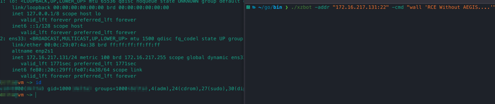
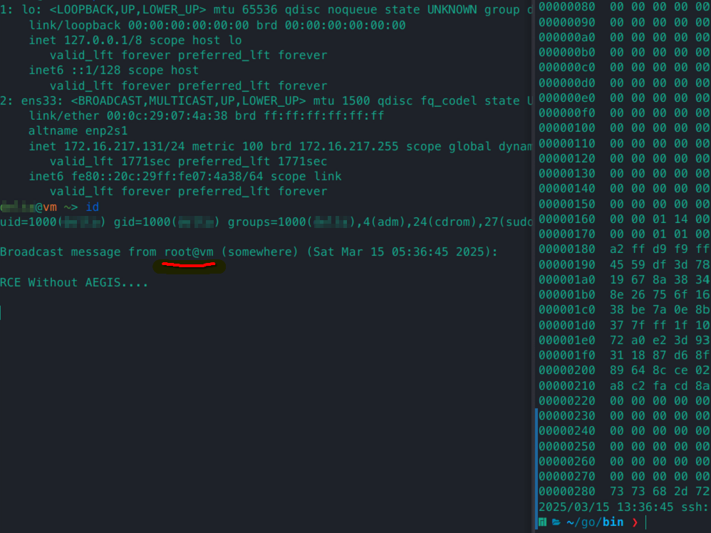
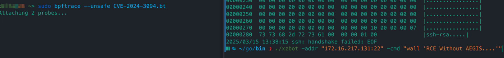
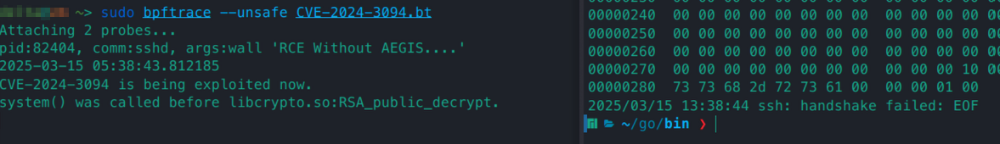
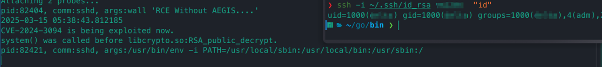

# XZ Backdoor (CVE-2024-3094) 

On March 29, 2024, Red Hat and the U.S. Cybersecurity and Infrastructure Security Agency (CISA) jointly issued a warning about a widespread high-risk vulnerability (CVSS score: 10) in the popular Linux compression tool, XZ Utils. Because XZ compression tools are widely used in various Linux distributions, checking and patching this vulnerability has become a top priority for enterprise IT and security teams this week.

The vulnerability, numbered CVE-2024-3094, affects the XZ Utils tool (versions 5.6.0 and 5.6.1), which is used for compressing and decompressing file formats. Red Hat stated that the tool exists in almost all Linux distributions.

This vulnerability impacts the OpenSSH daemon. Although OpenSSH does not directly link to the liblzma library, it communicates with systemd in a way that indirectly links to liblzma, exposing OpenSSH to malicious attacks.

Reproduction with https://github.com/amlweems/xzbot 

Attempt to exploit the XZ backdoor vulnerability for RCE will be made

Arbitrary commands can be executed as root

Run eBPF monitoring program

The exploit was successfully detected and blocked by sending a termination signal.

Meanwhile, normal and legitimate connections remain unaffected, with no false positives.

